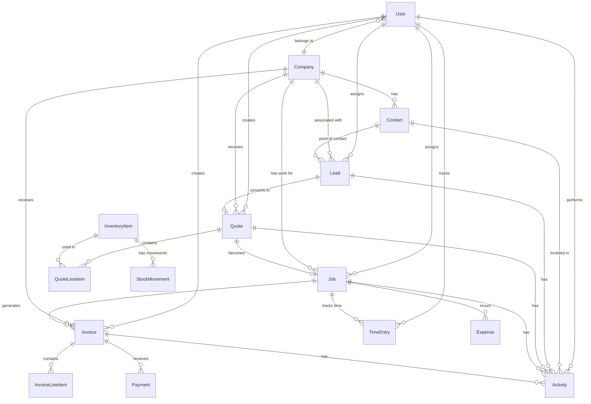

# BlueCollarCRM Data Model

## Entity Relationship Diagram

## Core Entities

### User Management

#### User
The central entity for system users (employees, contractors, admins).

**Key Fields:**
- `id`: Unique identifier (CUID)
- `email`: Primary login credential
- `phone`: Optional phone number for SMS auth
- `firstName`, `lastName`: User identification
- `role`: ADMIN, MANAGER, USER, VIEWER
- `status`: ACTIVE, INACTIVE, SUSPENDED
- `companyId`: Optional company association

**Business Rules:**
- Email must be unique across the system
- Phone numbers are optional but must be unique if provided
- Users can belong to one company or be system-wide admins
- Role determines access permissions throughout the system

#### Session
Manages user authentication sessions.

**Key Fields:**
- `sessionToken`: Unique session identifier
- `userId`: Reference to authenticated user
- `expires`: Session expiration timestamp

### Customer Management

#### Company
Represents customer organizations (construction companies, contractors, etc.).

**Key Fields:**
- `name`: Company name
- `industry`: CONSTRUCTION, PLUMBING, ELECTRICAL, HVAC, etc.
- `size`: SOLO, SMALL (2-10), MEDIUM (11-50), LARGE (51+)
- `status`: ACTIVE, INACTIVE, PROSPECT
- `address`, `city`, `state`, `zip`: Physical location
- `latitude`, `longitude`: GPS coordinates for mapping

**Business Rules:**
- Companies can have multiple contacts
- GPS coordinates enable route optimization
- Industry classification helps with targeted features
- Status tracks the sales pipeline stage

#### Contact
Individual people within customer companies.

**Key Fields:**
- `firstName`, `lastName`: Personal identification
- `email`, `phone`, `mobile`: Contact methods
- `title`, `department`: Role within company
- `isPrimary`: Designates main point of contact
- `companyId`: Required company association

**Business Rules:**
- Each company should have at least one primary contact
- Multiple contacts can exist per company
- Contact information is used for communication automation

### Sales Pipeline

#### Lead
Potential sales opportunities from initial contact to conversion.

**Key Fields:**
- `title`: Brief description of opportunity
- `value`: Estimated deal value
- `source`: WEBSITE, REFERRAL, GOOGLE_ADS, etc.
- `status`: NEW, CONTACTED, QUALIFIED, PROPOSAL_SENT, etc.
- `priority`: LOW, MEDIUM, HIGH, URGENT
- `assignedToId`: Responsible sales person
- `companyId`, `contactId`: Customer references

**Business Rules:**
- Leads progress through defined status stages
- Value estimates help with sales forecasting
- Source tracking enables marketing ROI analysis
- Assignment ensures accountability

#### Quote
Formal price estimates for potential work.

**Key Fields:**
- `quoteNumber`: Unique identifier for customer reference
- `title`, `description`: Quote details
- `status`: DRAFT, SENT, VIEWED, ACCEPTED, REJECTED, EXPIRED
- `validUntil`: Quote expiration date
- `subtotal`, `taxRate`, `taxAmount`, `total`: Pricing breakdown
- `jobSiteAddress`: Work location details

**Business Rules:**
- Quote numbers follow a sequential pattern (Q-YYYY-NNN)
- Pricing calculations are automated but can be overridden
- Job site information is crucial for field service work
- Quotes can convert to jobs when accepted

#### QuoteLineItem
Individual items within a quote (labor, materials, equipment).

**Key Fields:**
- `description`: Item description
- `quantity`: Amount needed
- `unitPrice`: Price per unit
- `total`: Calculated total (quantity × unitPrice)
- `itemType`: LABOR, MATERIAL, EQUIPMENT, OTHER
- `inventoryItemId`: Optional link to inventory

**Business Rules:**
- Line items can reference inventory for materials
- Labor items typically don't have inventory references
- Totals are calculated automatically
- Sort order determines display sequence

### Work Management

#### Job
Active work orders derived from accepted quotes.

**Key Fields:**
- `jobNumber`: Unique identifier (J-YYYY-NNN)
- `status`: SCHEDULED, IN_PROGRESS, COMPLETED, CANCELLED, ON_HOLD
- `priority`: Inherited from lead or manually set
- `scheduledStart`, `scheduledEnd`: Planned timeline
- `actualStart`, `actualEnd`: Actual execution times
- `estimatedHours`, `actualHours`: Time tracking
- `laborRate`: Billing rate for time

**Business Rules:**
- Jobs inherit information from quotes when created
- Scheduling enables calendar and route optimization
- Time tracking supports accurate billing
- Status updates trigger automated notifications

#### TimeEntry
Detailed time tracking for jobs.

**Key Fields:**
- `startTime`, `endTime`: Work period
- `totalHours`: Calculated duration
- `description`: Work performed
- `userId`: Worker identification
- `jobId`: Associated job

**Business Rules:**
- Time entries can be ongoing (no end time)
- Total hours are calculated automatically
- Multiple workers can track time on same job
- Data feeds into payroll and billing systems

#### Expense
Job-related expenses for accurate cost tracking.

**Key Fields:**
- `description`: Expense details
- `amount`: Cost amount
- `category`: MATERIALS, FUEL, EQUIPMENT, PERMITS, etc.
- `receiptUrl`: Digital receipt storage
- `jobId`: Associated job

**Business Rules:**
- Expenses reduce job profitability
- Categories enable cost analysis
- Receipt storage supports audit requirements
- Integration with accounting systems

### Billing & Payments

#### Invoice
Bills sent to customers for completed work.

**Key Fields:**
- `invoiceNumber`: Unique identifier (INV-YYYY-NNN)
- `status`: DRAFT, SENT, VIEWED, PAID, OVERDUE, CANCELLED
- `subtotal`, `taxRate`, `taxAmount`, `total`: Pricing
- `amountPaid`, `balanceDue`: Payment tracking
- `terms`, `notes`: Payment conditions
- `dueDate`: Payment deadline

**Business Rules:**
- Invoices can be generated from jobs or created manually
- Payment tracking enables aging reports
- Automated reminders for overdue invoices
- Integration with payment processors

#### InvoiceLineItem
Individual charges on an invoice.

**Key Fields:**
- `description`: Charge description
- `quantity`: Amount billed
- `unitPrice`: Rate per unit
- `total`: Line total

**Business Rules:**
- Line items can come from job time entries and expenses
- Manual line items allow for additional charges
- Totals roll up to invoice total

#### Payment
Records of customer payments against invoices.

**Key Fields:**
- `amount`: Payment amount
- `method`: CASH, CHECK, CREDIT_CARD, BANK_TRANSFER
- `reference`: Check number, transaction ID, etc.
- `stripePaymentId`: Integration with Stripe
- `paidAt`: Payment timestamp

**Business Rules:**
- Partial payments are supported
- Payment methods track customer preferences
- Integration with payment processors for automation
- Payment history supports customer credit decisions

### Inventory Management

#### InventoryItem
Materials and equipment tracked in the system.

**Key Fields:**
- `sku`: Stock keeping unit (unique identifier)
- `name`, `description`: Item identification
- `category`: Grouping for organization
- `unit`: Measurement unit (each, ft, lb, etc.)
- `costPrice`, `sellPrice`: Pricing information
- `currentStock`, `minStock`, `maxStock`: Quantity tracking

**Business Rules:**
- SKUs must be unique across all items
- Reorder alerts when stock falls below minimum
- Pricing supports margin calculations
- Categories enable organized browsing

#### StockMovement
Tracks all inventory changes for audit trail.

**Key Fields:**
- `type`: PURCHASE, SALE, ADJUSTMENT, RETURN
- `quantity`: Amount moved (positive or negative)
- `reference`: Purchase order, job number, etc.
- `unitCost`, `totalCost`: Cost tracking
- `createdAt`: Movement timestamp

**Business Rules:**
- All stock changes must be recorded
- Cost tracking enables FIFO/LIFO calculations
- Reference fields provide audit trail
- Automated movements from job completions

### Activity Tracking

#### Activity
Comprehensive log of all system interactions.

**Key Fields:**
- `type`: CALL, EMAIL, MEETING, NOTE, TASK, STATUS_CHANGE, etc.
- `title`, `description`: Activity details
- `userId`: Person who performed activity
- `leadId`, `contactId`, `quoteId`, `jobId`, `invoiceId`: Related entities
- `createdAt`: Activity timestamp

**Business Rules:**
- Activities provide complete audit trail
- Polymorphic relationships link to any entity
- Automated activities from system events
- Manual activities from user interactions

## Data Relationships

### One-to-Many Relationships
- Company → Contacts (one company has many contacts)
- Company → Leads (one company can have multiple opportunities)
- Quote → QuoteLineItems (one quote contains multiple line items)
- Job → TimeEntries (one job has multiple time tracking entries)
- Invoice → Payments (one invoice can receive multiple payments)

### One-to-One Relationships
- Lead → Quote (one lead can convert to one quote)
- Quote → Job (one accepted quote becomes one job)

### Many-to-Many Relationships
- Users ↔ Companies (users can work for multiple companies in enterprise setups)
- InventoryItems ↔ QuoteLineItems (items can appear in multiple quotes)

## Indexing Strategy

### Primary Indexes
- All `id` fields (automatic with CUID)
- `email` on User table (unique constraint)
- `sku` on InventoryItem table (unique constraint)

### Secondary Indexes
- `companyId` on all related tables
- `userId` on assignment and activity tables
- `status` fields for filtering
- `createdAt` for chronological queries
- Composite indexes on frequently queried combinations

### Full-Text Search
- Company names and descriptions
- Contact names and titles
- Lead and job titles
- Activity descriptions

## Data Validation

### Required Fields
- All entities require `id` and timestamps
- User requires `email`, `firstName`, `lastName`
- Company requires `name`
- Contact requires `firstName`, `lastName`, `companyId`

### Business Logic Validation
- Email format validation
- Phone number format validation
- Positive values for prices and quantities
- Date range validation (start < end)
- Status transition validation

### Referential Integrity
- Foreign key constraints on all relationships
- Cascade deletes where appropriate
- Soft deletes for audit trail preservation

## Performance Considerations

### Query Optimization
- Eager loading for related data
- Pagination for large result sets
- Caching for frequently accessed data
- Database connection pooling

### Storage Optimization
- Appropriate data types for fields
- Compression for large text fields
- Archival strategy for old data
- Backup and recovery procedures 