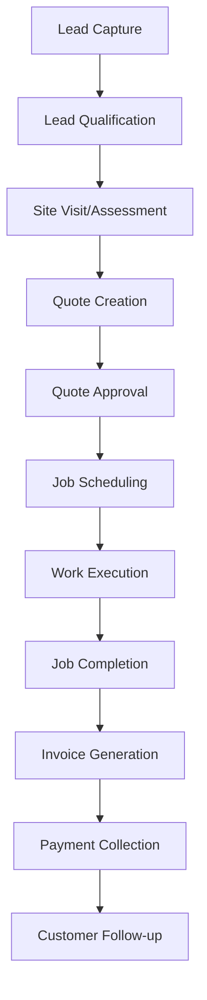
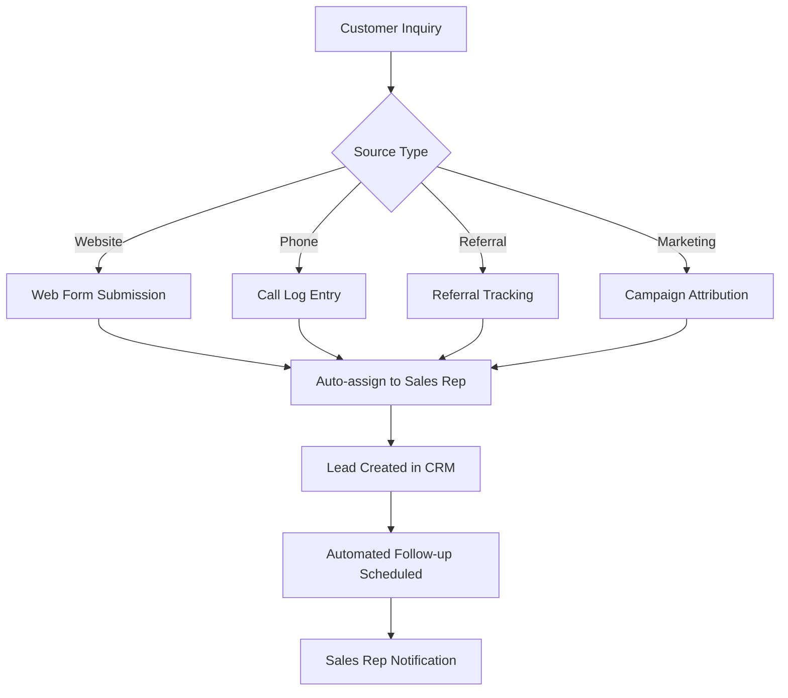
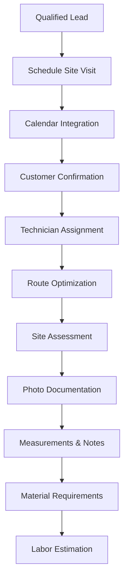
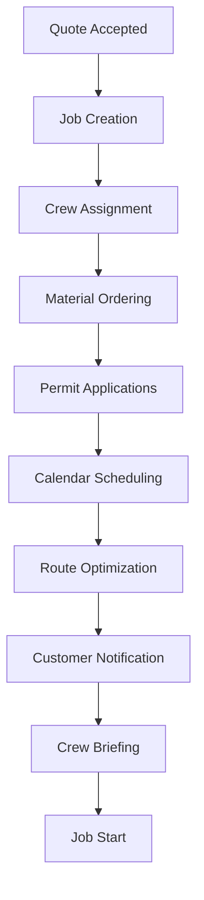
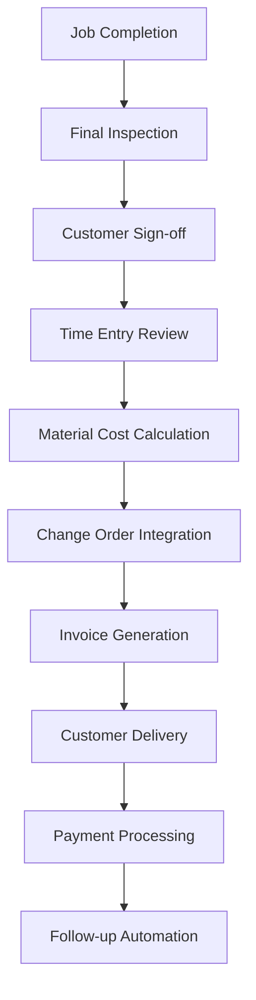
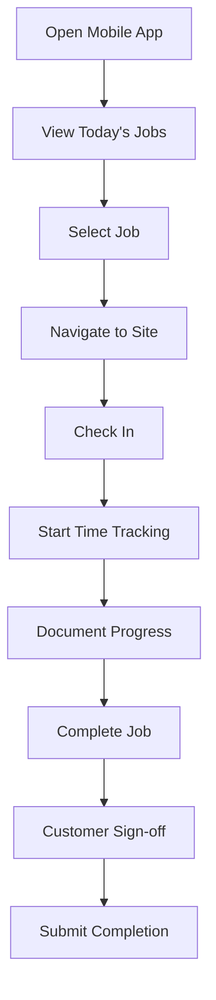

# BlueCollarCRM User Flows

## Lead-to-Cash Process

The core business process for blue-collar service companies from initial customer contact through payment collection.

### Overview Flow

## Detailed Process Flows

### 1. Lead Capture & Management

#### Lead Sources
- **Website Forms**: Contact forms, service requests
- **Phone Calls**: Direct customer inquiries
- **Referrals**: Existing customer recommendations
- **Marketing**: Google Ads, Facebook, trade shows
- **Walk-ins**: Direct office visits

#### Lead Capture Flow

#### Lead Qualification Process
1. **Initial Contact** (within 1 hour)
   - Phone call or email response
   - Basic needs assessment
   - Urgency evaluation
   - Budget qualification

2. **Lead Scoring**
   - Project size/value
   - Timeline urgency
   - Decision-maker access
   - Geographic location

3. **Status Updates**
   - NEW → CONTACTED → QUALIFIED → PROPOSAL_SENT

### 2. Site Assessment & Quoting

#### Site Visit Flow

#### Quote Creation Process
1. **Assessment Review**
   - Site photos and measurements
   - Material requirements list
   - Labor hour estimates
   - Equipment needs

2. **Pricing Calculation**
   - Material costs (from inventory)
   - Labor rates (by skill level)
   - Equipment rental/usage
   - Markup application
   - Tax calculations

3. **Quote Assembly**
   - Professional formatting
   - Terms and conditions
   - Payment schedule
   - Validity period
   - Digital signature capability

### 3. Job Scheduling & Execution

#### Scheduling Flow

#### Work Execution Process
1. **Job Preparation**
   - Material delivery coordination
   - Tool and equipment check
   - Safety briefing
   - Customer walkthrough

2. **Daily Operations**
   - Time tracking (start/stop)
   - Progress photo updates
   - Material usage logging
   - Issue/change order documentation

3. **Quality Control**
   - Work inspection checkpoints
   - Customer approval stages
   - Safety compliance verification
   - Progress reporting

### 4. Billing & Payment Collection

#### Invoice Generation Flow

#### Payment Collection Process
1. **Invoice Delivery**
   - Email with PDF attachment
   - Online payment portal link
   - Payment terms reminder
   - Due date notification

2. **Payment Tracking**
   - Payment status monitoring
   - Automated reminders
   - Aging report generation
   - Collection workflow triggers

3. **Payment Processing**
   - Multiple payment methods
   - Automatic reconciliation
   - Receipt generation
   - Accounting system integration

## User Role Workflows

### Sales Representative Flow

#### Daily Activities
1. **Morning Routine**
   - Review assigned leads
   - Check follow-up tasks
   - Plan site visits
   - Update calendar

2. **Lead Management**
   - Respond to new inquiries
   - Conduct qualification calls
   - Schedule assessments
   - Update lead status

3. **Quote Management**
   - Create detailed estimates
   - Follow up on pending quotes
   - Handle customer questions
   - Process quote approvals

### Field Technician Flow

#### Job Execution
1. **Pre-Job Preparation**
   - Review job details
   - Check material availability
   - Plan route to job site
   - Verify customer contact

2. **On-Site Activities**
   - Customer check-in
   - Work area setup
   - Time tracking start
   - Progress documentation

3. **Job Completion**
   - Final quality check
   - Customer walkthrough
   - Time tracking stop
   - Completion documentation

### Office Manager Flow

#### Administrative Tasks
1. **Daily Operations**
   - Review overnight inquiries
   - Process payments
   - Update job schedules
   - Handle customer calls

2. **Reporting & Analysis**
   - Generate daily reports
   - Monitor KPIs
   - Track team performance
   - Identify bottlenecks

3. **Customer Service**
   - Handle complaints
   - Process change requests
   - Coordinate follow-ups
   - Manage communications

## Mobile-First Workflows

### Field Worker Mobile App Flow

#### Job Management

#### Key Mobile Features
- **Offline Capability**: Work without internet
- **GPS Integration**: Automatic location tracking
- **Photo Capture**: Progress and completion photos
- **Digital Signatures**: Customer approvals
- **Time Tracking**: One-tap start/stop
- **Material Scanning**: Barcode/QR code support

### Customer Portal Flow

#### Self-Service Options
1. **Service Requests**
   - Online form submission
   - Photo upload capability
   - Urgency selection
   - Preferred contact method

2. **Project Tracking**
   - Real-time job status
   - Progress photo viewing
   - Schedule updates
   - Communication history

3. **Billing & Payments**
   - Invoice viewing
   - Online payment processing
   - Payment history
   - Receipt downloads

## Automation Workflows

### Lead Nurturing Automation

#### Email Sequences
1. **Immediate Response** (within 5 minutes)
   - Thank you for inquiry
   - Next steps explanation
   - Contact information

2. **Follow-up Sequence** (if no response)
   - Day 1: Personal follow-up
   - Day 3: Value proposition
   - Day 7: Case study/testimonial
   - Day 14: Final attempt

#### SMS Automation
- Appointment reminders
- Job start notifications
- Completion confirmations
- Payment reminders

### Job Management Automation

#### Scheduling Automation
- Automatic crew assignment based on skills
- Route optimization for multiple jobs
- Material delivery coordination
- Customer notification sequences

#### Progress Tracking
- Milestone completion alerts
- Delay notifications
- Quality checkpoint reminders
- Customer update automation

## Integration Workflows

### Accounting System Integration

#### QuickBooks Integration
1. **Customer Sync**
   - Company → Customer
   - Contact → Customer Contact
   - Automatic updates

2. **Invoice Sync**
   - CRM Invoice → QB Invoice
   - Payment tracking
   - Tax calculation sync

3. **Expense Tracking**
   - Job expenses → QB expenses
   - Category mapping
   - Receipt attachment

### Marketing Platform Integration

#### Lead Source Tracking
- Google Ads conversion tracking
- Facebook lead form integration
- Website form submissions
- Call tracking integration

#### Campaign Performance
- Lead source attribution
- Conversion rate tracking
- ROI calculation
- Automated reporting

## Performance Metrics & KPIs

### Sales Metrics
- Lead response time
- Lead-to-quote conversion rate
- Quote-to-job conversion rate
- Average deal size
- Sales cycle length

### Operational Metrics
- Job completion time
- Customer satisfaction scores
- Technician utilization rates
- Material waste percentage
- Rework incidents

### Financial Metrics
- Gross margin per job
- Collection period
- Outstanding receivables
- Profit per customer
- Monthly recurring revenue

## Error Handling & Recovery

### Common Failure Scenarios
1. **Payment Processing Failures**
   - Retry mechanisms
   - Alternative payment methods
   - Manual processing fallback

2. **Communication Failures**
   - Email delivery issues
   - SMS delivery problems
   - Notification backup systems

3. **Data Sync Issues**
   - Offline data storage
   - Conflict resolution
   - Manual sync triggers

### Recovery Procedures
- Automatic retry logic
- Manual intervention points
- Data backup and restore
- Customer communication protocols 